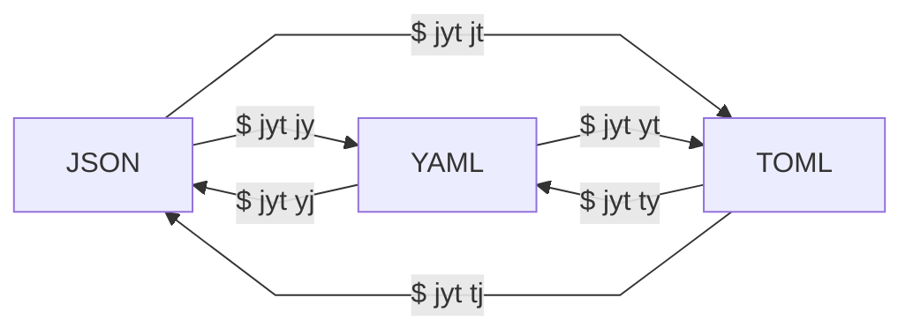

いい感じに JSON <> YAML <> TOML の変換をする CLI が欲しかったため、開発してみました。
以下のリンクが、今回開発した `jyt` のレポジトリになります。

https://github.com/ken-matsui/jyt

それぞれ、**J**son, **Y**aml, **T**oml の頭文字を取った名称です。

みんな考えることは同じなのか、非常に似た名前で、`yj` という Go 製の CLI もあるみたいです。

https://github.com/sclevine/yj

# 特徴

* Rust 製
* Wasm 対応
* 順序保持

# インストール方法

Rust 製なので、[crates.io](https://crates.io/crates/jyt) に公開しています。
そのため、以下のコマンドでインストールできます。

```bash
$ cargo install jyt
```

また WebAssembly として、[wapm.io](https://wapm.io/ken-matsui/jyt) にも公開しています。
それをインストールする場合は、以下のコマンドでインストールできます。

```bash
$ wapm install ken-matsui/jyt
```

# 使い方

使い方はシンプルで、以下のヘルプのように、実行できます。

```bash
$ jyt --help
jyt 0.1.0
Ken Matsui <26405363+ken-matsui@users.noreply.github.com>
A tridirectional converter between Json, Yaml, and Toml

USAGE:
    jyt <SUBCOMMAND>

OPTIONS:
    -h, --help       Print help information
    -V, --version    Print version information

SUBCOMMANDS:
    help            Print this message or the help of the given subcommand(s)
    json-to-toml    Convert Json to Toml (also as `json2toml`, `j2t`, and `jt`)
    json-to-yaml    Convert Json to Yaml (also as `json2yaml`, `j2y`, and `jy`)
    toml-to-json    Convert Toml to Json (also as `toml2json`, `t2j`, and `tj`)
    toml-to-yaml    Convert Toml to Yaml (also as `toml2yaml`, `t2y`, and `ty`)
    yaml-to-json    Convert Yaml to Json (also as `yaml2json`, `y2j`, and `yj`)
    yaml-to-toml    Convert Yaml to Toml (also as `yaml2toml`, `y2t`, and `yt`)
```

図にすると、以下のようになります。



こういうのを tridirectional と言わない気もしたんですが、以下の画像でも tridirectional と言っているので、合っていると思いたいです。


*Source: [Complex tridirectional interactions and influences](https://www.researchgate.net/figure/Complex-tridirectional-interactions-and-influences-AED-Antiepileptic-drug_fig1_276602956)*

## 実行例

パイプを使用できるように実装しているため、以下のように `cat` コマンドと組み合わせることができます。

```yaml
$ cat ./examples/example.json | jyt json-to-yaml
---
title: TOML Example
owner:
  name: Tom Preston-Werner
database:
  server: 192.168.1.1
  ports:
    - 8000
    - 8001
    - 8002
  connection_max: 5000
  enabled: true
```

examples は、以下のリンクにあります。

https://github.com/ken-matsui/jyt/tree/main/examples

また、順序保持が保証されているため、以下のようなコマンドを実行しても、正しく成功します。
元の TOML ファイルと、`jyt` を使用して、TOML -> YAML -> JSON -> TOML という変換を施したファイルが、一致することが示されています。

```bash
$ test "$(cat ./examples/example.toml)" = "$(cat ./examples/example.toml | jyt ty | jyt yj | jyt jt)"

$ echo $?
0
```

:::message alert
TOML の `datetime` 型等の、変換の際に特殊な対応が必要な情報を含んでいる場合は、上記のコマンドが上手くいかないかもしれません。
:::

## ユースケース

例えば、[ESLint](https://eslint.org/) という JavaScript の Linter の設定ファイルには大概 JSON が使用されています。
ただ、僕を含め一定数 YAML 層がいて、ブログ記事等に公開されている `.eslintrc.json` を人力で変換するのは面倒だなと思っていました。
こういった時に、CLI でサクッと変換ができると便利です。

以下の記事から、シンプルな `.eslintrc.json` を拝借し、変換してみます。

https://qiita.com/mysticatea/items/f523dab04a25f617c87d#-%E3%83%AB%E3%83%BC%E3%83%AB%E3%81%AE%E3%82%AA%E3%83%97%E3%82%B7%E3%83%A7%E3%83%B3%E3%82%92%E4%BD%BF%E3%81%86

`.eslintrc.json`

```json
{
    "extends": "eslint:recommended",
    "env": {"browser": true},
    "rules": {
        "semi": ["error", "never"]
    }
}
```

以下のコマンドを実行すると、簡単に YAML に変換できます。

```bash
cat .eslintrc.json | jyt jy > .eslintrc.yaml
```

`.eslintrc.yaml`

```yaml
---
extends: "eslint:recommended"
env:
  browser: true
rules:
  semi:
    - error
    - never
```

# 実装

実装も非常にシンプルになっています。

以下 3 点のライブラリをそれぞれ抽象化し、変換元の拡張子と対応するライブラリを選択して deserialize、そしてサブコマンドとして指定された対象の拡張子と対応するライブラリを選択して serialize を行っています。

1. [`serde_json`](https://crates.io/crates/serde_json)
2. [`serde_yaml`](https://crates.io/crates/serde_yaml)
3. [`toml-rs`](https://crates.io/crates/toml)

https://github.com/ken-matsui/jyt/blob/main/src/lib.rs

# 最後に

軽量な相互変換 CLI として、結構便利なんじゃないかなと思います。
また、Wasm としても公開しているので、Web 上でも実行できます。

https://wapm.io/ken-matsui/jyt

上記サイトから、`Open in Shell` をクリックすると、Web 上で実行できます。

もし良ければ、使ってみていただけると幸いです。
